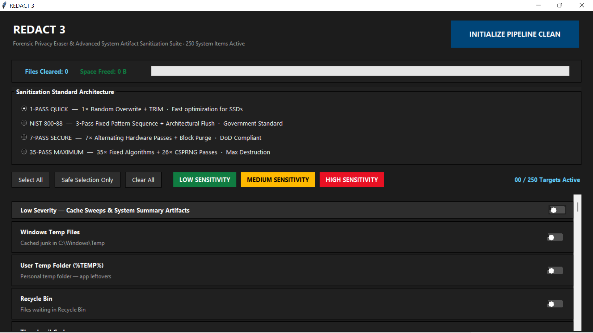

# REDACT 3

[](https://opensource.org/licenses/MIT)
[]()
[]()
[]()

**REDACT 3** is an open-source, forensic-grade Windows privacy tool that locates and cryptographically destroys the system artifacts, tracking databases, and application footprints that Windows silently accumulates during ordinary use — data that persists long after a user believes it has been deleted.

Standard cleaning utilities operate on surface-level user directories. REDACT 3 goes deeper, targeting low-level system forensic markers, restricted registry hives, filesystem journals, browser credential stores, and OS telemetry databases that most cleaners never touch.

Built with a **Windows 11 Fluent Dark UI**, it presents all 250 targets in a clean, toggle-driven dashboard that gives you full control over exactly what gets wiped.

> Unlike CCleaner or BleachBit, REDACT 3 targets the forensic-layer artifacts those tools never reach — ShimCache, AmCache, BAM, NTFS journals, and Windows Recall.

---

## Screenshot



---

## Who is this for?

- **Privacy-conscious users** who want meaningful control over what Windows remembers about them
- **IT professionals and sysadmins** preparing machines for redeployment, resale, or handoff
- **Journalists, researchers, and activists** working in sensitive environments
- **Developers and power users** who understand what these artifacts contain and want them gone
- **Anyone donating or selling a PC** who wants to ensure personal data doesn't travel with it

> REDACT 3 is intended for use on machines you own or are authorised to manage. It is not intended for use in circumventing lawful investigations or any activity prohibited by law in your jurisdiction.

---

## Features

- **250 individually selectable sanitization targets** across 3 sensitivity tiers
- **4 cryptographic wipe standards** — from a fast 1-pass SSD-optimised wipe to the full 35-pass Gutmann method
- **10-browser coverage** — Chrome, Edge, Firefox, Brave, Vivaldi, Arc, Zen, Pale Moon, Tor, and Comet
- **Registry cleaning** with direct `winreg` access and `reg.exe` fallback
- **Windows Recall / CoreAI** database and screenshot store destruction
- **Real-time monitor** showing live file count, bytes freed, and progress
- **Safe Selection preset** — one click enables everything except irreversible high-risk items
- **No external dependencies** — pure Python standard library only
- **Auto-elevates** to Administrator via UAC on first launch

---

## Privacy Architecture

REDACT 3 includes three internal hardening measures designed to prevent the tool's own execution from leaving a recoverable trace:

- **Transient Execution Splitting** — On launch, if the executable name contains "REDACT", the process clones itself to a randomised temporary name and re-executes from there, reducing its visibility in process history logs (Prefetch, BAM).
- **NTFS File Cliff Masking** — After each wipe batch, the engine writes and immediately deletes a cluster of random dummy files, smoothing the deletion spike in NTFS metadata that would otherwise stand out in a forensic timeline.
- **Registry LastWrite Spoofing** — Before deleting a registry key, REDACT writes and removes a decoy value in the parent key, rolling its `LastWrite` timestamp forward and obscuring when the target subkey was actually removed.

---

## The 250-Target Matrix

Targets are organised into three tiers. Each item is individually togglable.

### 🟢 Tier 1 — Low Sensitivity (60 items)
Safe ephemeral caches that Windows rebuilds automatically. Zero functional impact when removed.

- Windows & user temp folders, Recycle Bin, thumbnail and icon caches
- Prefetch files, font cache, DirectX shader cache
- Windows Error Reports, update leftovers, Delivery Optimization cache
- Diagnostic logs, telemetry staging, speech model caches, and more

### 🟡 Tier 2 — Medium Sensitivity (69 items)
Application history, browser caches, and usage records. May reset UI preferences in affected apps.

- File Explorer recent files, jump lists, Run dialog history, clipboard history
- Windows Event Logs, PowerShell command history, Windows Search history
- Browser caches across all 10 supported browsers
- App histories for Teams, Discord, Zoom, Steam, Spotify, VS Code, Blender, Unity, and more
- Developer tool caches: npm, pip, Go build cache, Android Studio, Sublime Text

### 🔴 Tier 3 — High Sensitivity (121 items)
Primary forensic artifacts and OS-level databases. Review each item before selecting.

| Target | What it exposes |
|---|---|
| AmCache Hive | Every program ever installed or run |
| AppCompatCache (ShimCache) | Every executable ever launched |
| Background Activity Monitor (BAM) | Kernel-level execution timestamps |
| NTFS Change Journal (`$UsnJrnl`) | Every file operation ever — create, rename, delete |
| Volume Shadow Copies (VSS) | Snapshots investigators use to recover deleted files |
| Shell Bags | Every folder ever opened, including USB drives |
| UserAssist | Encrypted launch count for every application |
| SRUM Database | Per-app network and CPU usage over time |
| Windows Recall / CoreAI | AI-captured screenshots and semantic timeline database |
| USB Device History (USBSTOR) | Serial numbers of every USB ever plugged in |
| Browser histories & passwords | Chrome, Edge, Firefox, Brave, Vivaldi, Arc, Zen, and more |
| Windows Search Index | Text snippets from documents, including deleted ones |
| Hibernation File (`hiberfil.sys`) | Full RAM dump captured at sleep — may contain open docs and keys |

> ⚠️ Items such as the Downloads folder, saved Wi-Fi passwords, Volume Shadow Copies, and browser credential stores are **excluded from the Safe Selection preset** because their removal is irreversible. Select them only if you understand what they contain.

---

## Installation & Usage

**Requirements:** Python 3.9+, Windows 10 or 11 (64-bit), Administrator privileges.

```bash
# Run directly
python REDACT.py
```

REDACT 3 will auto-elevate via UAC if the current session lacks Administrator rights.

**To build a standalone executable:**

```bash
pip install pyinstaller
pyinstaller --onefile --windowed --uac-admin --icon=logo.ico REDACT.py
```

No pip packages are required to run the script itself — only PyInstaller is needed if you want to compile to `.exe`.

---

## Wipe Standards

| Mode | Passes | Description |
|---|---|---|
| **1-Pass Quick** | 1 | Single cryptographic random overwrite + TRIM. Recommended for SSDs. |
| **NIST 800-88** | 3 | Fixed-pattern sequence per NIST SP 800-88. Accepted by US government agencies. |
| **7-Pass Secure** | 7 | Alternating DoD 5220.22-M pattern. For sensitive unclassified material. |
| **35-Pass Gutmann** | 35 | 9 fixed-pattern passes + 26 CSPRNG passes. Maximum destruction. |

> Note: On NVMe/SSD drives, wear-levelling means multi-pass file wiping is not guaranteed to reach original physical cells. For solid-state media, the 1-Pass + TRIM method combined with full-drive encryption is the most reliable approach.

---

## ⚠️ Disclaimer

REDACT 3 **permanently destroys data**. Wiped files cannot be recovered. Registry keys deleted by REDACT are gone. Volume Shadow Copies, once deleted, remove your ability to restore previous file versions.

Always ensure you have backups of anything you want to keep before running this tool. The authors accept no liability for data loss, system instability, or any other consequence arising from its use.

This software is provided as-is under the MIT License.

---

## License

MIT — see [LICENSE](LICENSE) for details.
