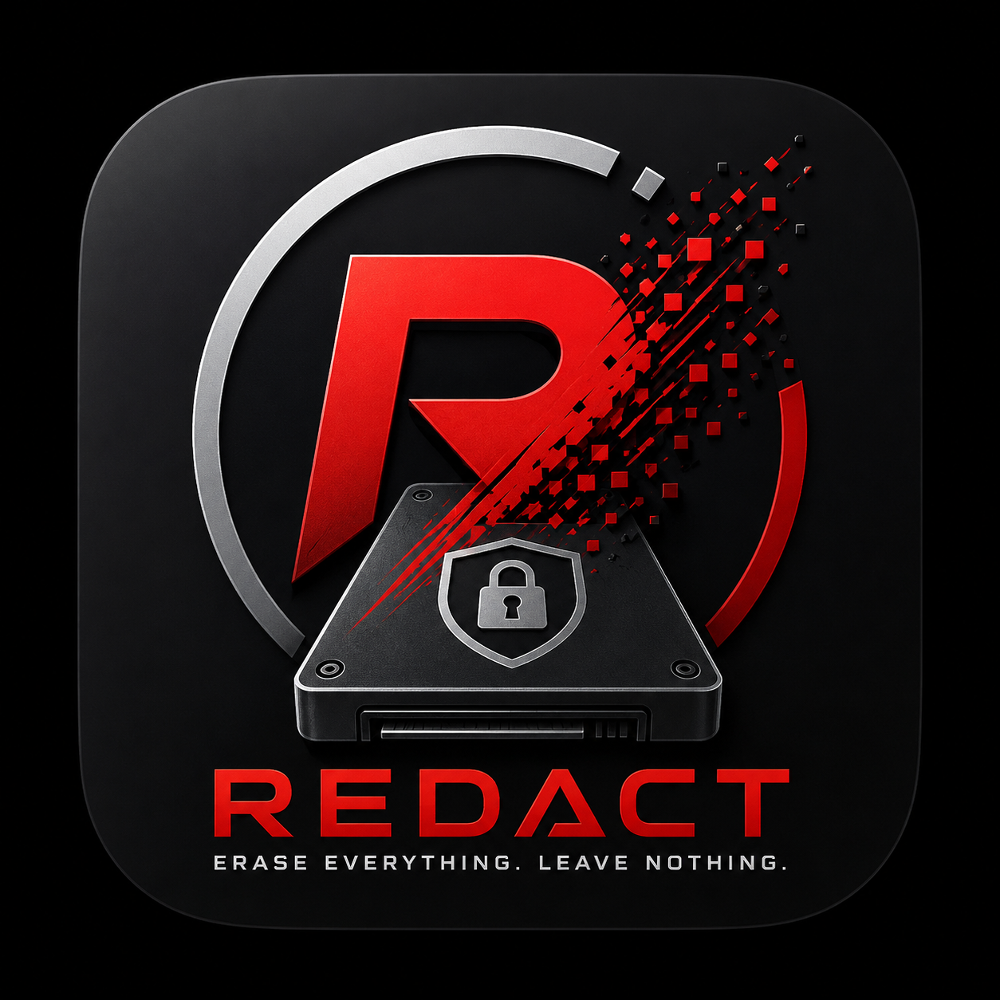
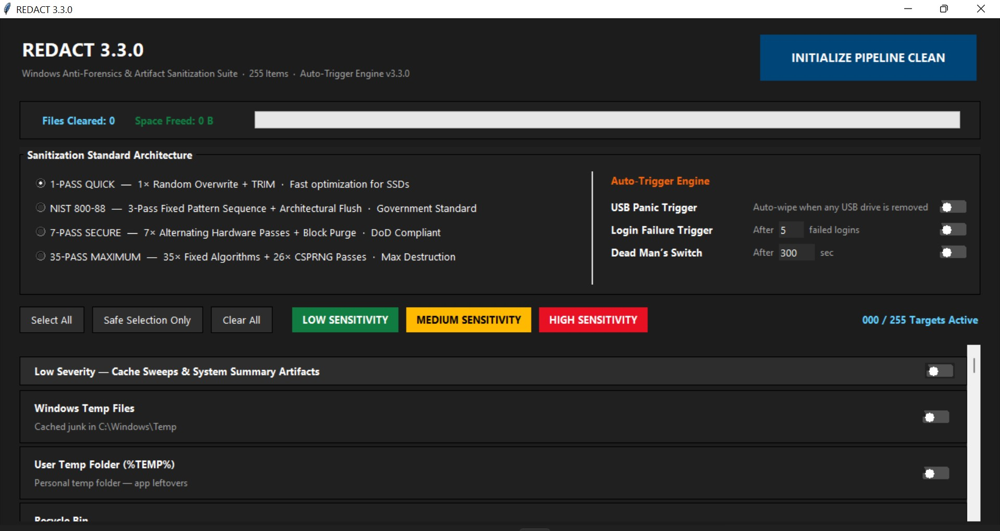

<p align="center">
  
</p>

<h1 align="center">REDACT 3.3.0</h1>

<p align="center">
  <a href="https://ko-fi.com/yonasabeselom">
    
  </a>
</p>

> ☕ If REDACT helped you, [buy me a coffee](https://ko-fi.com/yonasabeselom) to keep development going.

<p align="center">
  <i>ERASE EVERYTHING. LEAVE NOTHING.</i>
</p>

<p align="center">
  <b>255 targets · 3 tiers · 4 wipe standards · 10 browsers · Live RAM Wipe · Cryptographic Erasure · Auto-Trigger Engine · BitLocker Safety Gate · Windows 11</b>
</p>

<p align="center">
  <a href="https://github.com/yonasabeselom/redact/stargazers"></a>
  <a href="https://github.com/yonasabeselom/redact/network/members"></a>
  <a href="https://github.com/yonasabeselom/redact/watchers"></a>
</p>

<p align="center">
  <a href="https://www.gnu.org/licenses/gpl-3.0.html"></a>
  
  
  
  <a href="https://sourceforge.net/projects/redact/"></a>
  <a href="https://github.com/yonasabeselom/redact/releases"></a>
</p>

<p align="center">
  <b>Author:</b> Yonas Abeselom &nbsp;|&nbsp; <a href="mailto:yonas_abeselom@protonmail.com">yonas_abeselom@protonmail.com</a> &nbsp;|&nbsp; <a href="https://github.com/yonasabeselom">github.com/yonasabeselom</a>
</p>

<p align="center">
  <b>⭐ If REDACT is useful to you, please star this repository — it helps other privacy-conscious users find it.</b>
</p>

---

## Download

📦 **[Download standalone .exe on SourceForge](https://sourceforge.net/projects/redact/)** — no Python installation required. Runs on any Windows 10 or 11 (64-bit) machine as Administrator.

Or run directly from source — see [Installation & Usage](#installation--usage) below.

---

## Screenshot



---

## Who is this for?

- **Privacy-conscious users** who want meaningful control over what Windows remembers about them
- **IT professionals and sysadmins** preparing machines for redeployment, resale, or handoff
- **Journalists, researchers, and activists** working in sensitive environments
- **Developers and power users** who understand what these artifacts contain and want them gone
- **Anyone donating or selling a PC** who wants to ensure personal data doesn't travel with it

> REDACT 3.3.0 is intended for use on machines you own or are authorised to manage. It is not intended for use in circumventing lawful investigations or any activity prohibited by law in your jurisdiction.

---

## Features

- **255 individually selectable sanitization targets** across 3 sensitivity tiers
- **4 cryptographic wipe standards** — from a fast 1-pass SSD-optimised wipe to the full 35-pass Gutmann method
- **10-browser coverage** — Chrome, Edge, Firefox, Brave, Vivaldi, Arc, Zen, Pale Moon, Tor, and Comet
- **Live RAM overwrite** — overwrites free physical memory pages with random bytes + zeros while the machine is running, defeating live RAM acquisition tools
- **Cryptographic erasure** — BitLocker VMK header destruction and VeraCrypt container header nuking without mounting or decrypting
- **EFS & Windows Hello key destruction** — RSA private keys, DPAPI master keys, and NGC biometric key store
- **Registry cleaning** with direct `winreg` access and `reg.exe` fallback
- **Windows Recall / CoreAI** database and screenshot store destruction
- **Auto-Trigger Engine** — three independent background monitors that fire a HIGH-tier wipe automatically: USB panic trigger, login failure trigger, and dead man's switch countdown
- **Real-time monitor** showing live file count, bytes freed, and progress
- **Safe Selection preset** — one click enables everything except irreversible high-risk items
- **No external dependencies** — pure Python standard library only
- **Auto-elevates** to Administrator via UAC on first launch

---

## Privacy Architecture

REDACT 3.3.0 includes three internal hardening measures designed to prevent the tool's own execution from leaving a recoverable trace:

- **Transient Execution Splitting** — On launch, if the executable name contains "REDACT", the process clones itself to a randomised temporary name and re-executes from there, reducing its visibility in process history logs (Prefetch, BAM).
- **NTFS File Cliff Masking** — After each wipe batch, the engine writes and immediately deletes a cluster of random dummy files, smoothing the deletion spike in NTFS metadata that would otherwise stand out in a forensic timeline.
- **Registry LastWrite Spoofing** — Before deleting a registry key, REDACT writes and removes a decoy value in the parent key, rolling its `LastWrite` timestamp forward and obscuring when the target subkey was actually removed.

---

## The 255-Target Matrix

Targets are organised into three tiers. Each item is individually togglable.

### 🟢 Tier 1 — Low Sensitivity (60 items)
Safe ephemeral caches that Windows rebuilds automatically. Zero functional impact when removed.

- Windows & user temp folders, Recycle Bin, thumbnail and icon caches
- Prefetch files, font cache, DirectX shader cache
- Windows Error Reports, update leftovers, Delivery Optimization cache
- Diagnostic logs, telemetry staging, speech model caches, and more

### 🟡 Tier 2 — Medium Sensitivity (69 items)
Application history, browser caches, and usage records. May reset UI preferences in affected apps.

- File Explorer recent files, jump lists, Run dialog history, clipboard history
- Windows Event Logs, PowerShell command history, Windows Search history
- Browser caches across all 10 supported browsers
- App histories for Teams, Discord, Zoom, Steam, Spotify, VS Code, Blender, Unity, and more
- Developer tool caches: npm, pip, Go build cache, Android Studio, Sublime Text

### 🔴 Tier 3 — High Sensitivity (126 items)
Primary forensic artifacts, OS-level databases, live memory, and cryptographic key material. Review each item before selecting.

| Target | What it destroys |
|---|---|
| AmCache Hive | Record of every program ever installed or run |
| AppCompatCache (ShimCache) | Every executable ever touched on the filesystem |
| Background Activity Monitor (BAM) | Kernel-level execution timestamps |
| NTFS Change Journal (`$UsnJrnl`) | Every file operation ever — create, rename, delete |
| Volume Shadow Copies (VSS) | Snapshots investigators use to recover deleted files |
| Shell Bags | Every folder ever opened, including USB drives |
| UserAssist | Encrypted launch count for every application |
| SRUM Database | Per-app network and CPU usage for 60 days |
| Windows Recall / CoreAI | AI-captured screenshots and semantic timeline database |
| USB Device History (USBSTOR) | Serial numbers of every USB ever plugged in |
| Browser histories & passwords | Chrome, Edge, Firefox, Brave, Vivaldi, Arc, Zen, and more |
| Windows Search Index | Text snippets from documents, including deleted ones |
| Hibernation File (`hiberfil.sys`) | Full RAM dump captured at sleep |
| **Live RAM Overwrite** *(new)* | Free physical memory pages — defeats live RAM acquisition |
| **BitLocker Header Destruction** *(new)* | VMK header — ciphertext permanently unrecoverable without it |
| **VeraCrypt Container Nuke** *(new)* | Primary + backup headers of all `.vc`/`.hc` containers |
| **EFS Key Material Wipe** *(new)* | RSA private keys + DPAPI master keys for file encryption |
| **Windows Hello / NGC Store** *(new)* | PIN, fingerprint, and facial recognition key material |

> ⚠️ Items such as the Downloads folder, saved Wi-Fi passwords, Volume Shadow Copies, browser credential stores, and the new cryptographic erasure items are **excluded from the Safe Selection preset** because their removal is irreversible. Select them only if you understand what they contain.

---

## Auto-Trigger Engine — How It Works

REDACT 3.3.0 introduces three independent background monitors. Each runs on its own thread with its own stop event — activating or cancelling one has no effect on the others. All three can run simultaneously.

### USB Panic Trigger

Arm it with a USB drive present. REDACT locks the set of currently connected removable drives as a baseline and polls `GetLogicalDrives` + `GetDriveTypeW` every second. The moment any drive in the baseline disappears — wipe fires immediately, with no confirmation dialog.

**Use case:** a dedicated USB kept plugged in at all times. Pull it on the way out the door. The wipe is already running before anyone reaches the keyboard.

### Login Failure Trigger

Configurable threshold (default: 5 attempts). REDACT queries the Windows Security Event Log for Event ID 4625 (failed logon) every 5 seconds, tracking the delta from a baseline captured at arming time. Covers wrong passwords, wrong PIN, failed Windows Hello, failed RDP, and failed network logon attempts.

**Use case:** a seized machine where an attacker is brute-forcing the lock screen. After the configured number of failures, REDACT fires silently in the background.

### Dead Man's Switch

Configurable countdown in seconds (default: 300). A live timer is shown in the trigger panel, turning red below 60 seconds. When the countdown reaches zero — wipe fires. Toggle off at any time to cancel cleanly.

**Use case:** a machine taken into a room you cannot follow. Arm the switch for the expected window. If it isn't back in your hands before it expires — wiped.

### What the auto-wipe does

All three triggers execute the same pipeline: **1-Pass** wipe standard across all **126 HIGH-sensitivity items** — silently, with no UI interaction required. A notification is shown on completion if the app window is still accessible.

---

## Live RAM Overwrite — How It Works

REDACT 3.3.0 is the only open-source Windows GUI tool with built-in live RAM sanitization. When selected, it:

1. Queries available physical RAM via `GlobalMemoryStatusEx`
2. Forces Python garbage collection to maximise free page frames
3. Allocates 85% of free RAM in 64 MB chunks, filling each with cryptographically random bytes (pass 1) then zeros (pass 2)
4. Releases all chunks — pages return to the OS in a zeroed state
5. Trims the tool's own working set via `EmptyWorkingSet`
6. Sets `ClearPageFileAtShutdown = 1` — pagefile is zeroed on every future shutdown
7. Disables hibernation — removes `hiberfil.sys` (a full compressed RAM dump)

**What this defeats:** Live RAM acquisition tools such as Magnet RAM Capture, DumpIt, and Belkasoft RAM Capturer can image free page frames and recover data from recently exited processes. This step overwrites those frames before they can be captured.

**Honest limit:** Pages currently locked by the OS kernel or active processes cannot be touched from userspace. For the hardware layer beneath, pair with [AAD-50](#companion-tool--aad-50).

---

## Cryptographic Erasure — How It Works

Rather than decrypting volumes (which is slow, requires the key, and leaves plaintext on disk temporarily), REDACT 3.3.0 uses **cryptographic erasure** — destroying only the key material that makes encrypted data readable. This is faster, more secure, and recognised by NIST 800-88 as a valid sanitization method.

| Item | Method | Effect |
|---|---|---|
| **BitLocker Header Destruction** | Overwrites first 16 sectors (8 KB) of every drive. OS drive safety gate added in v3.2.1 — shows critical warning before proceeding on the system drive. | VMK gone — ciphertext permanently unreadable. No password or recovery key can help. |
| **VeraCrypt Container Nuke** | Overwrites first 512 bytes + last 512 bytes of all `.vc`/`.hc` files | Both headers destroyed — container is indistinguishable from random noise. |
| **EFS Key Wipe** | Wipes `%APPDATA%\Microsoft\Crypto\RSA`, `Crypto\Keys`, `Protect` + runs `cipher /rekey` | EFS-encrypted files on disk become permanently unreadable, even with valid login. ⚠️ If you have EFS-encrypted files, they will be permanently inaccessible. |
| **Windows Hello / NGC** | Wipes NGC folder + HelloData + registry reference + `dsregcmd /leave` | Hello PIN, fingerprint, and face keys gone — must re-enroll after reboot. |

---

## Installation & Usage

**Requirements:** Python 3.9+, Windows 10 or 11 (64-bit), Administrator privileges.

```bash
# Run directly
python REDACT.py
```

REDACT 3.3.0 will auto-elevate via UAC if the current session lacks Administrator rights.

**To build a standalone executable:**

```bash
pip install pyinstaller
pyinstaller --onefile --windowed --uac-admin --icon=logo.ico --name="REDACT 3.3.0" "REDACT.py"
```

No pip packages are required to run the script itself — only PyInstaller is needed if you want to compile to `.exe`.

---

## Why REDACT vs Other Tools

| Feature | REDACT 3.3.0 | CCleaner | BleachBit | PrivaZer |
|---|---|---|---|---|
| **Auto-Trigger Engine** | ✅ USB / Login / Countdown | ❌ | ❌ | ❌ |
| **Open source** | ✅ GPL v3 | ❌ Proprietary | ✅ GPL | ❌ Proprietary |
| **Forensic artifact targets** | ✅ 255 (AmCache, BAM, ShimCache, SRUM…) | ❌ Basic only | ⚠️ Limited | ⚠️ Partial |
| **Live RAM overwrite** | ✅ | ❌ | ❌ | ❌ |
| **BitLocker header destruction** | ✅ | ❌ | ❌ | ❌ |
| **VeraCrypt container nuke** | ✅ | ❌ | ❌ | ❌ |
| **EFS / Windows Hello key wipe** | ✅ | ❌ | ❌ | ❌ |
| **Windows Recall / CoreAI** | ✅ | ❌ | ❌ | ❌ |
| **Registry LastWrite spoofing** | ✅ | ❌ | ❌ | ❌ |
| **NTFS File Cliff Masking** | ✅ | ❌ | ❌ | ❌ |
| **Transient Execution Splitting** | ✅ | ❌ | ❌ | ❌ |
| **4 cryptographic wipe standards** | ✅ | ❌ | ⚠️ Basic | ⚠️ Partial |
| **10-browser coverage** | ✅ | ⚠️ Partial | ⚠️ Partial | ⚠️ Partial |
| **No telemetry / phoning home** | ✅ | ❌ (Free tier) | ✅ | ❌ |
| **No external dependencies** | ✅ | N/A | N/A | N/A |

REDACT 3.3.0 is the only open-source Windows privacy tool built specifically to defeat forensic analysis at every layer — OS artifacts, live RAM, encrypted volume key material, biometric credentials, and now automated trigger-based execution.

---

## Wipe Standards

| Mode | Passes | Description |
|---|---|---|
| **1-Pass Quick** | 1 | Single cryptographic random overwrite + TRIM. Recommended for SSDs. |
| **NIST 800-88** | 3 | Fixed-pattern sequence per NIST SP 800-88. Accepted by US government agencies. |
| **7-Pass Secure** | 7 | Alternating DoD 5220.22-M pattern. For sensitive unclassified material. |
| **35-Pass Gutmann** | 35 | 9 fixed-pattern passes + 26 CSPRNG passes. Maximum destruction. |

> Note: On NVMe/SSD drives, wear-levelling means multi-pass file wiping is not guaranteed to reach original physical cells. For solid-state media, the 1-Pass + TRIM method combined with full-drive encryption is the most reliable approach.

---

## Companion Tool — AAD-50

REDACT 3.3.0 handles **OS-level** privacy cleaning — files, caches, registry traces, browser history, live RAM, cryptographic key material, and automated trigger-based wiping.

For **firmware-level NVMe drive sanitization** — full physical destruction of all NAND cells including over-provisioned zones, FTL mapping tables, and hardware-level cryptographic keys — see the companion tool:

🔒 **[AAD-50 — Abeselom ASIC-Direct 50](https://github.com/yonasabeselom/aad50)** — 50-cycle, hardware-confirmed NVMe sanitization with SHA-256 audit chain and PDF Certificate of Destruction. Adopted into linux-nvme/nvme-cli master in 14 days. Confirmed by NVM Express Administration as recommended best practice. Compliant with IEEE 2883.1-2025.

> Together, **REDACT 3.3.0 + AAD-50** cover the complete forensic stack — from Windows registry and live RAM down to the raw NAND cells. No other open-source toolchain does both.

---

## Companion Tool — TRACE

Before you clean, know exactly what you're cleaning. TRACE is a Windows forensic artifact scanner that detects, scores, and reports on **100 high-value forensic artifacts** across your system — giving you a precise exposure score before you run REDACT.

🔍 **[TRACE 1.0 — Windows Forensic Exposure Scanner](https://github.com/yonasabeselom/trace)** — scans 100 artifacts across HIGH / MEDIUM / LOW risk tiers, computes a weighted exposure score out of 100, and exports a full PDF report to Desktop.

- **100 forensic artifacts** — registry hives, prefetch, USB history, LNK files, shellbags, jump lists, SRUM, browser history, Windows Event Logs, and more
- **Weighted exposure score 0–100** — HIGH artifacts worth 3 pts, MEDIUM 2 pts, LOW 1 pt
- **Real-time colour-coded terminal output** — found vs not found per artifact
- **PDF report** saved to Desktop — cover page, full results table, tier breakdown
- **Auto-elevates to Administrator** — no manual UAC steps needed
- **Zero install, fully offline** — no internet connection, no telemetry

> **TRACE** shows you exactly what forensic evidence exists on your machine.  
> **REDACT 3.3.0** cleans it at the OS level — files, registry, RAM, credentials, browser history.  
> **AAD-50** erases it at the firmware level down to the raw NAND cells.  
> Use all three for complete full-stack coverage — from artifact discovery to physical erasure.

---

## Changelog

### v3.3.0 — August 2026

- **Auto-Trigger Engine:** Three independent background monitors that fire a HIGH-tier wipe automatically without user interaction.
  - **USB Panic Trigger:** Arms on currently connected removable drives. Fires the moment any drive in the baseline is removed.
  - **Login Failure Trigger:** Monitors Windows Security Event Log (Event ID 4625). Fires after a configurable number of failed logon attempts (default: 5). Covers password, PIN, Windows Hello, RDP, and network logon failures.
  - **Dead Man's Switch:** Configurable countdown timer (default: 300 s). Live display in trigger panel. Fires at zero; cancels cleanly at any time.
- **Multi-trigger queue:** Each trigger has its own `threading.Event` stop signal. All three can run simultaneously. Stopping one does not affect the others.
- **`_stop_trigger(name)` / `_stop_all_triggers()`:** Granular stop methods. `_stop_all_triggers()` called automatically on window close via `WM_DELETE_WINDOW`.
- **Auto-wipe pipeline:** All triggers execute 1-Pass wipe across all 126 HIGH-sensitivity items silently.

### v3.2.1 — August 2026

- **BitLocker OS Drive Safety Gate:** Before executing Item 252 (BitLocker Header Destruction), REDACT now detects whether the target volume is the Windows system drive. If BitLocker is active on the system drive, a blocking confirmation dialog halts execution and warns the user that proceeding will make Windows permanently unbootable. If the user declines, the system drive is skipped and all other volumes proceed normally. Secondary and external BitLocker volumes are unaffected.
- **EFS Key Wipe — Warning Added:** Item 254 description now explicitly warns that EFS-encrypted files will become permanently inaccessible after this wipe. This cannot be undone.
- **Window Title Fix:** Title bar now correctly displays REDACT 3.2 instead of REDACT 3.

### v3.2 — August 2026

- **Item 251 — Live RAM Overwrite:** Allocates 85% of free physical RAM in 64 MB chunks, fills with random bytes then zeros, trims working set, sets pagefile to zero on shutdown, disables hibernation. First open-source Windows GUI tool with live RAM sanitization.
- **Item 252 — BitLocker Header Destruction:** Overwrites BitLocker VMK headers on all drive volumes via raw `CreateFileW` handle. NIST 800-88 Cryptographic Erase — no mounting or decryption required.
- **Item 253 — VeraCrypt Container Nuke:** Scans all drive roots and user profile for `.vc`/`.hc`/`.veracrypt` files, overwrites primary and backup headers (512 bytes each). Container permanently sealed.
- **Item 254 — EFS Key Material Wipe:** Destroys RSA private key files, DPAPI master keys, and credential store entries used by Windows EFS. Runs `cipher /rekey` to sever the EFS chain.
- **Item 255 — Windows Hello / NGC Key Store:** Wipes NGC biometric key folder, HelloData, account picture cache, NGC registry reference, and runs `dsregcmd /leave` to detach Azure AD binding.
- Item count updated to **255** across all UI labels and assertions.
- Title updated to **REDACT 3.2** in window title bar and header label.

### v3 — July 2026

- Complete rewrite to zero-footprint architecture
- **250 sanitization targets** across 3 sensitivity tiers
- **Windows 11 Fluent Dark UI** — per-item toggle switches across tier-grouped cards
- **Windows Recall / CoreAI** destruction added
- **Transient Execution Splitting**, **NTFS File Cliff Masking**, **Registry LastWrite Spoofing**
- **4 wipe standards** — 1-Pass Quick, NIST 800-88, 7-Pass DoD, 35-Pass Gutmann
- **10-browser coverage** — Chrome, Edge, Firefox, Brave, Vivaldi, Arc, Zen, Pale Moon, Tor, Comet
- **Safe Selection preset**, **Real-time monitor**, **Auto-UAC elevation**
- **No external dependencies** — pure Python standard library

---

## Contributing

Bug reports, target suggestions, and pull requests are welcome.

- **Bug reports:** Open a [GitHub Issue](https://github.com/yonasabeselom/redact/issues) with your Windows version, Python version, and the full error output.
- **New targets:** If you know of a forensic artefact not currently covered, open an issue describing the registry path or file location.
- **Contact:** [yonas_abeselom@protonmail.com](mailto:yonas_abeselom@protonmail.com)

---

## ⚠️ Disclaimer

REDACT 3.3.0 **permanently destroys data**. Wiped files cannot be recovered. Registry keys deleted by REDACT are gone. Volume Shadow Copies, once deleted, remove your ability to restore previous file versions. BitLocker and VeraCrypt header destruction renders encrypted volumes permanently inaccessible — there is no recovery path.

Always ensure you have backups of anything you want to keep before running this tool. The author accepts no liability for data loss, system instability, or any other consequence arising from its use.

This software is provided as-is under the GNU General Public License (GPL) v3.

---

## License

GPL v3 — see [LICENSE](LICENSE) for full terms. Source code is free to use, modify, and redistribute under the GPL. Any derivative works must also be released under the GPL.
